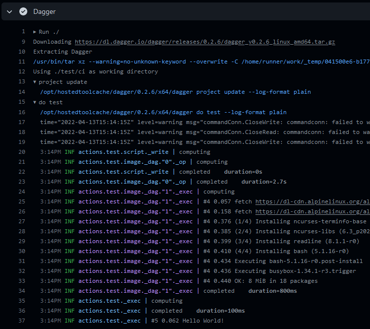

[](https://github.com/dagger/dagger-for-github/releases/latest)
[](https://github.com/marketplace/actions/dagger-for-github)
[](https://github.com/dagger/dagger-for-github/actions?workflow=test)
[](https://codecov.io/gh/dagger/dagger-for-github)

## About

GitHub Action for [Dagger](https://dagger.io), a programmable deployment system.



___

* [Usage](#usage)
  * [Basic](#basic)
  * [Install Only](#install-only)
  * [Multiple commands](#multiple-commands)
* [Customizing](#customizing)
  * [inputs](#inputs)
* [License](#license)

## Usage

### Basic

```yaml
name: dagger

on:
  push:
    branches:
      - main

jobs:
  deploy:
    runs-on: ubuntu-latest
    steps:
      -
        name: Checkout
        uses: actions/checkout@v3
      -
        name: Dagger
        uses: dagger/dagger-for-github@v3
        with:
          cmds: do test
```

### Install Only

```yaml
steps:
  -
    name: Install Dagger
    uses: dagger/dagger-for-github@v3
    with:
      install-only: true
  -
    name: Show Dagger version
    run: dagger version
```

### Multiple commands

```yaml
steps:
  -
    name: Dagger
    uses: dagger/dagger-for-github@v3
    with:
      cmds: |
        project update
        do test
```

## Customizing

### inputs

Following inputs can be used as `step.with` keys

> `List` type is a newline-delimited string
> ```yaml
> cmds: |
>   project update
>   do test
> ```

| Name             | Type   | Default      | Description                                                                            |
|------------------|--------|--------------|----------------------------------------------------------------------------------------|
| `version`        | String | `latest`     | Dagger version (e.g., `v0.2.7`, `latest`, `https://github.com/dagger/dagger.git#main`) |
| `cmds`           | List   |              | List of Dagger commands                                                                |
| `workdir`        | String | `.`          | Working directory (below repository root)                                              |
| `install-only`   | Bool   | `false`      | Just install Dagger                                                                    |
| `cleanup`        | Bool   | `true`       | Cleanup Dagger home folder at the end of a job                                         |

## Development

```shell
# format code and build javascript artifacts
docker buildx bake pre-checkin

# validate all code has correctly formatted and built
docker buildx bake validate

# run tests
docker buildx bake test
```

## License

Apache-2.0 License. See `LICENSE` for more details.
