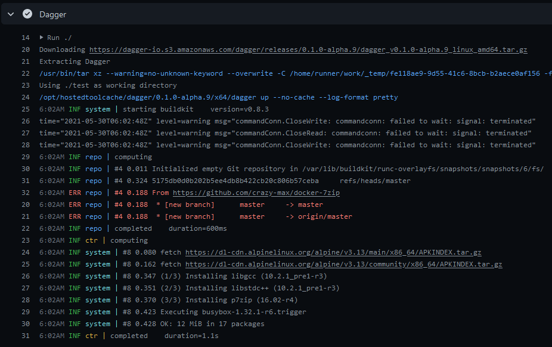

[](https://github.com/crazy-max/dagger-action/releases/latest)
[](https://github.com/marketplace/actions/dagger-action)
[](https://github.com/crazy-max/dagger-action/actions?workflow=test)
[](https://codecov.io/gh/crazy-max/dagger-action)
[](https://github.com/sponsors/crazy-max)
[](https://www.paypal.me/crazyws)

## About

GitHub Action for [Dagger](https://dagger.io), a programmable deployment system.



___

* [Usage](#usage)
  * [Basic](#basic)
  * [Install Only](#install-only)
* [Customizing](#customizing)
  * [inputs](#inputs)
* [License](#license)

## Usage

### Basic

```yaml
name: dagger

on:
  push:
    branches:
      - master

jobs:
  deploy:
    runs-on: ubuntu-latest
    steps:
      -
        name: Checkout
        uses: actions/checkout@v2
      -
        name: Dagger
        uses: crazy-max/dagger-action@v1
        with:
          age-key: ${{ secrets.DAGGER_AGE_KEY }}
          args: up
```

### Install Only

```yaml
steps:
  -
    name: Install Dagger
    uses: crazy-max/dagger-action@v1
    with:
      install-only: true
  -
    name: Show Dagger version
    run: dagger version
```

## Customizing

### inputs

Following inputs can be used as `step.with` keys

| Name             | Type    | Default      | Description                                                      |
|------------------|---------|--------------|------------------------------------------------------------------|
| `version`        | String  | `latest`     | Dagger version                                                   |
| `age-key`        | String  |              | Dagger private key                                               |
| `args`           | String  |              | Arguments to pass to Dagger                                      |
| `workdir`        | String  | `.`          | Working directory (below repository root)                        |
| `install-only`   | Bool    | `false`      | Just install Dagger                                              |

## Development

```shell
# format code and build javascript artifacts
docker buildx bake pre-checkin

# validate all code has correctly formatted and built
docker buildx bake validate

# run tests
docker buildx bake test
```

## How can I help?

All kinds of contributions are welcome :raised_hands:! The most basic way to show your support is to star :star2:
the project, or to raise issues :speech_balloon: You can also support this project by
[**becoming a sponsor on GitHub**](https://github.com/sponsors/crazy-max) :clap: or by making a
[Paypal donation](https://www.paypal.me/crazyws) to ensure this journey continues indefinitely! :rocket:

Thanks again for your support, it is much appreciated! :pray:

## License

MIT. See `LICENSE` for more details.
